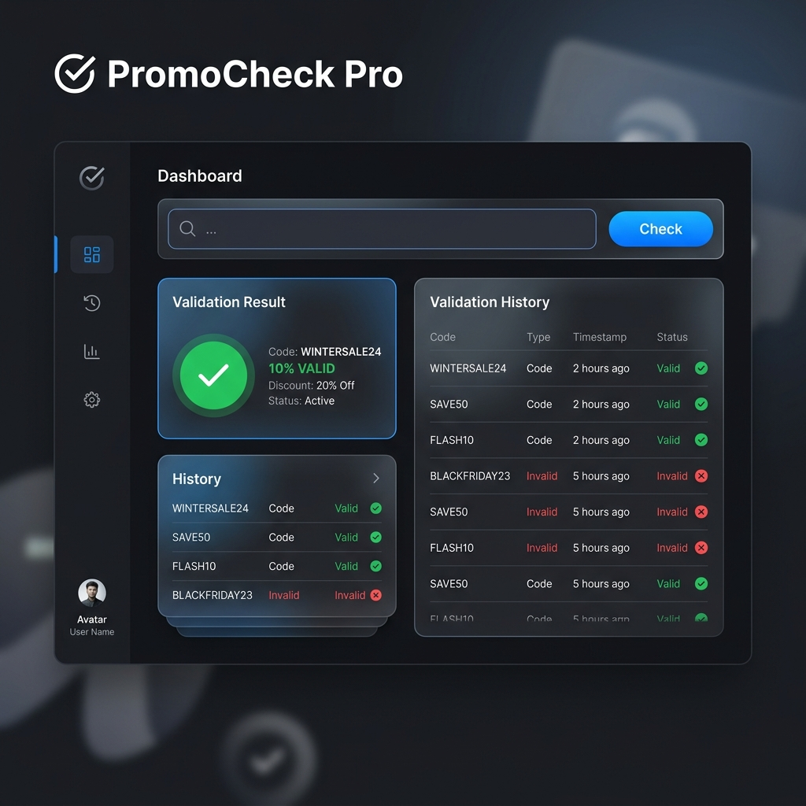

# 🚀 PromoCheck Pro — Global Validator



**PromoCheck Pro** is a high-performance, professional web application designed for real-time promo code validation. Built with a focus on speed, aesthetics, and user experience, it serves as a robust tool for retail staff and administrators to manage and verify discounts globally.

---

## ✨ Key Features

- **🌐 Global Localization**
  - Instant interface switching between **English**, **Ukrainian**, **French**, and **Spanish**.
  - All labels, placeholders, and status messages are fully localized.

- **🔒 Advanced Authentication**
  - Secure login and registration system.
  - Profile management for personal information and preferences.
  - Google OAuth integration (UI/Mock ready).

- **☁️ Supabase Integration**
  - Cloud-based data persistence for user profiles and promo action history.
  - Real-time synchronization across sessions.

- **🌓 Dynamic Theme Engine**
  - Seamless toggle between **Light** and **Dark** modes.
  - Remembers user preference via local storage.

- **📊 Real-time Action Log**
  - Detailed history of activated codes with timestamps.
  - Persistent storage via Supabase backend.

- **📱 Premium Responsive Design**
  - Stunning modern UI with smooth transitions and glassmorphism effects.
  - Optimized for both desktop and mobile devices.

---

## 🛠️ Technology Stack

- **Core:** HTML5, Modern Vanilla JavaScript (ES6+).
- **Styling:** Custom Vanilla CSS with HSL color system and dynamic variables.
- **Backend:** [Supabase](https://supabase.com/) for Database & Auth.
- **Icons:** Font Awesome 6.
- **Typography:** Google Fonts (Inter).

---

## 🚀 Getting Started

### Prerequisites
To use the cloud features (Supabase), ensure you have an internet connection.

### Installation
1. Clone the repository:
   ```bash
   git clone https://github.com/rederdge/Promo.git
   ```
2. Navigate to the project folder:
   ```bash
   cd Promo
   ```
3. Open `index.html` in any modern web browser.

### Configuration
The application is pre-configured with a Supabase instance. To use your own:
1. Update `SUPABASE_URL` and `SUPABASE_ANON_KEY` in the `<script>` section of `index.html`.
2. Ensure your Supabase tables (`users`, `promo_history`) match the application schema.

---

## 📖 How It Works

1. **Enter Code:** Type any promo code into the main input field.
2. **Check Status:** Click "CHECK STATUS" to verify validity.
3. **Redeem:** If valid, click "ACTIVATE NOW" to redeem the code.
4. **History:** View your redeemed codes in the "Action Log" below.

---

## 🤝 Contributing

Contributions are welcome! Please feel free to submit a Pull Request.

---

## 📄 License

This project is licensed under the MIT License - see the LICENSE file for details.

---

*Developed with ❤️ for a better checkout experience.*
